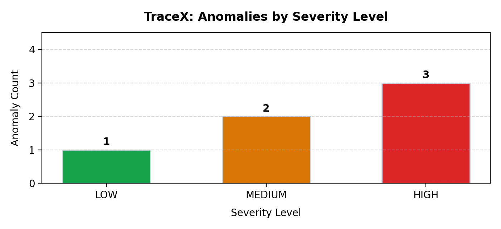
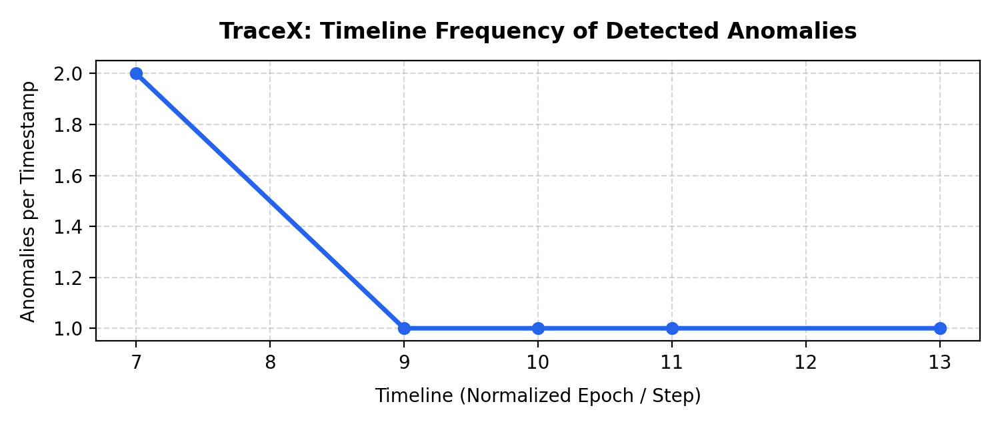
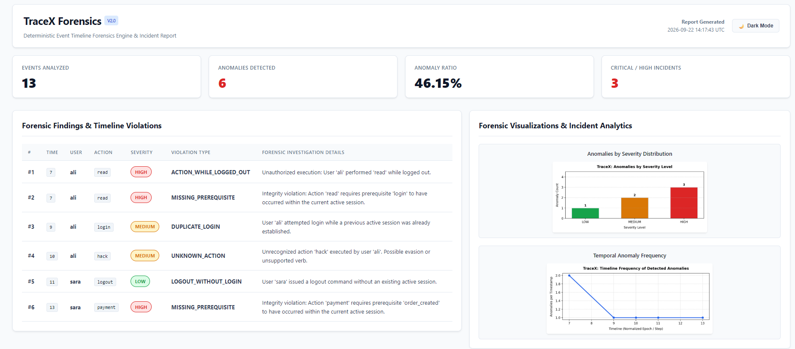

# TraceX 🔍 — Event Timeline Forensics Engine

[](https://www.python.org/)
[](LICENSE)
[]()
[]()

**TraceX** is a lightweight, deterministic event timeline forensics engine designed for security auditors, incident responders, and compliance analysts. It reconstructs and inspects user activity logs to detect security anomalies, session hijacking, tampering, and logical workflow violations.

Built in **Pure Python + Matplotlib**, TraceX operates with **zero machine learning black-boxes**, **zero cloud dependencies**, and **no external databases**, guaranteeing 100% reproducible, explainable, and verifiable forensic findings.

---

## ⚡ Key Capabilities

* **🔒 Session Lifecycle & Scoping:** Enforces strict session boundaries. Prevents cross-session prerequisite leakage by isolating active session state from all-time user history and clearing session context upon logout.
* **⏳ Clock Skew & Log Tampering Detection:** Flags chronological order regressions (`TIME_ORDER`) where log timestamps go backwards, often indicative of log injection or evasion attempts.
* **🌐 Flexible Timestamp Normalization:** Ingests standard sequential ticks, Unix epoch timestamps, and full ISO-8601 strings (e.g., `2026-09-22T14:30:00Z`).
* **🤖 Rapid Burst & Bot Identification:** Detects sub-second burst execution deltas between sequential user actions, flagging automated scripts and brute-force attempts.
* **⏱️ Temporal Window Rules:** Enforces strict time limits between prerequisites and subsequent actions (e.g., `payment` must follow `order_created` within 30 minutes).
* **📄 Multi-Format Ingestion:** Seamlessly parses standard JSON arrays and line-delimited JSON (`.jsonl` / `.ndjson`) for high-throughput streaming.
* **📊 Multi-Channel Reporting:**
  * **Interactive HTML Dashboard:** Modern executive dashboard featuring Dark/Light mode toggles, KPI summary cards, and color-coded incident tables.
  * **CSV Findings:** Standardized format for spreadsheet triage and Excel import.
  * **Machine-Readable JSON:** Structured output for SIEM ingestion and CI/CD security pipelines.
  * **Matplotlib Visualizations:** Severity distribution bar charts and temporal frequency scatter plots.

---

## 🏗️ Architecture & Forensic Pipeline

```
Raw Audit Logs (JSON / JSONL)
             │
             ▼
   [ Data Validation ]       ──► Checks required fields, types & ISO timestamps
             │
             ▼
   [ Timeline Auditing ]     ──► Flags log tampering & inverted timestamps
             │
             ▼
  [ Chronological Sort ]     ──► Orders events by normalized epoch time
             │
             ▼
   [ User State Machine ]    ──► Tracks active sessions, prerequisites & idle timeouts
             │
             ▼
    [ Anomaly Factory ]      ──► Classifies severity (HIGH, MEDIUM, LOW) & reasons
             │
             ▼
   [ Multi-Format Output ]   ──► Terminal Report | HTML Dashboard | CSV | JSON | Plots
```

---

## 🚀 Quick Start

### 1. Prerequisites
TraceX requires Python 3.8+ and `matplotlib` for charts:
```bash
pip install matplotlib
```

### 2. Run the Demonstration Pipeline
Clone the repository and run the engine:
```bash
python tracex.py
```
This executes a full forensic audit over sample incident records, outputs a console diagnostic log, and generates `tracex_demo_report.html`.

### 3. Run Self-Diagnostic Suite
Verify engine detection accuracy and rule enforcement:
```bash
python tracex.py --test
```

---

## 📋 Detected Anomaly Categories

| Anomaly Type | Severity | Description |
| :--- | :---: | :--- |
| `ACTION_WHILE_LOGGED_OUT` | **HIGH** | User attempted authenticated action without an active session. |
| `MISSING_PREREQUISITE` | **HIGH** | Action executed without its prerequisite happening inside the active session. |
| `TIME_ORDER` | **HIGH** | Event timestamp precedes previous event; indicates clock skew or log tampering. |
| `DUPLICATE_LOGIN` | **MEDIUM** | Login attempted while a valid active session is already registered. |
| `SESSION_EXPIRED` | **MEDIUM** | User action executed after inactivity exceeded `SESSION_TIMEOUT_SECONDS`. |
| `PREREQUISITE_TIMEOUT` | **MEDIUM** | Delay between prerequisite and action exceeded allowed temporal window. |
| `UNKNOWN_ACTION` | **MEDIUM** | Unrecognized verb/action not present in whitelist configuration. |
| `LOGOUT_WITHOUT_LOGIN` | **LOW** | Logout event received with no corresponding active session. |
| `RAPID_BURST` | **LOW** | Actions executed faster than humanly possible (potential bot/script). |

---

## 🖥️ Interactive CLI Navigation

Launch the built-in interactive shell by calling `main()` or running `tracex.py`:

```text
=======================================================
                     TRACE-X v2.0                 
           Event Timeline Forensics Engine        
=======================================================
1. Analyze current events
2. Load events file (JSON / JSON Lines .jsonl)
3. Show events table
4. Show detected anomalies
5. Show forensic metrics & statistics
6. Plot anomalies by severity
7. Plot anomalies over timeline
8. Export report (HTML / CSV / JSON)
9. Run self-test suite
10. Exit
```

---

## 📁 Sample Event Structure

Events can be provided as a standard JSON list or `.jsonl` lines:

```json
[
  {
    "time": "2026-09-22T10:00:00Z",
    "user": "analyst_1",
    "action": "login"
  },
  {
    "time": "2026-09-22T10:02:15Z",
    "user": "analyst_1",
    "action": "order_created"
  },
  {
    "time": "2026-09-22T10:04:30Z",
    "user": "analyst_1",
    "action": "payment"
  }
]
```

---

## 📊 Forensic Visualizations & Analytics

TraceX automatically compiles and renders high-resolution forensic visualization charts on every audit run:

| Anomalies by Severity Level | Incident Frequency Over Timeline |
| :---: | :---: |
|  |  |

---

## 🎨 Interactive Executive HTML Dashboard

TraceX generates an interactive incident dashboard tailored for Security Operations Centers (SOC):



* **⚡ Side-by-Side Dual Pane:** Forensic Findings Table on the left paired with live visual analytics on the right.
* **🌓 Light / Dark Mode:** One-click instant theme toggle for daytime auditing or dark-mode SOC environments.
* **📈 Executive KPIs:** Real-time summary cards highlighting total logs analyzed, anomaly ratio, and critical high-risk incidents.
* **🔍 Incident Investigation Table:** Complete forensic violation breakdown with timestamps, involved users, and root cause notes.

Preview file: [`tracex_demo_report.html`](tracex_demo_report.html)

---

## 📜 License

This project is licensed under the MIT License - see the [LICENSE](LICENSE) file for details.
